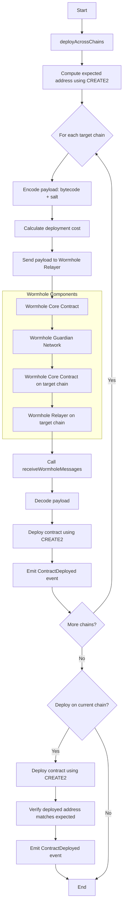

# User Flow

```mermaid
flowchart TD
    A[Start] --> B[deployAcrossChains]
    B --> C[Compute expected address using CREATE2]
    C --> D{For each target chain}
    D --> E[Encode payload: bytecode + salt]
    E --> F[Calculate deployment cost]
    F --> G[Send payload to Wormhole Relayer]
    G --> H[Wormhole Core Contract]
    H --> I[Wormhole Guardian Network]
    I --> J[Wormhole Core Contract on target chain]
    J --> K[Wormhole Relayer on target chain]
    K --> L[Call receiveWormholeMessages]
    L --> M[Decode payload]
    M --> N[Deploy contract using CREATE2]
    N --> P[Emit ContractDeployed event]
    P --> Q{More chains?}
    Q -->|Yes| D
    Q -->|No| S{Deploy on current chain?}
    S -->|Yes| T[Deploy contract using CREATE2]
    T --> U[Verify deployed address matches expected]
    U --> V[Emit ContractDeployed event]
    V --> R[End]
    S -->|No| R[End]
    subgraph Wormhole Components
    H
    I
    J
    K
    end
```