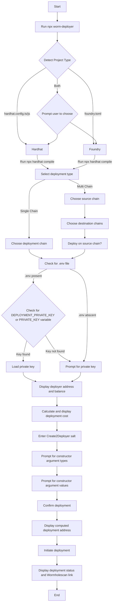

```mermaid
flowchart TD
    A[Start] --> B[Run npx worm-deployer]
    B --> C{Detect Project Type}
    C -->|hardhat.config.ts/js| D[Hardhat]
    C -->|foundry.toml| E[Foundry]
    C -->|Both| F{Prompt user to choose}
    F --> D
    F --> E
    D --> |Run npx hardhat compile| I[Select deployment type]
    E --> |Run npx hardhat compile| I[Select deployment type]
    I -->|Single Chain| J[Choose deployment chain]
    I -->|Multi Chain| K[Choose source chain]
    K --> L[Choose destination chains]
    L --> M[Deploy on source chain?]
    J --> N[Check for .env file]
    M --> N
    N -->|.env present| O{Check for DEPLOYMENT_PRIVATE_KEY or PRIVATE_KEY variable}
    O -->|Key found| P[Load private key]
    O -->|Key not found| Q[Prompt for private key]
    N -->|.env abscent| Q
    P --> R[Display deployer address and balance]
    Q --> R
    R --> S[Calculate and display deployment cost]
    S --> T[Enter Create2Deployer salt]
    T --> U[Prompt for constructor argument types]
    U --> V[Prompt for constructor argument values]
    V --> W[Confirm deployment]
    W --> X[Display computed deployment address]
    X --> Y[Initiate deployment]
    Y --> Z[Display deployment status and Wormholescan link]
    Z --> AA[End]
```