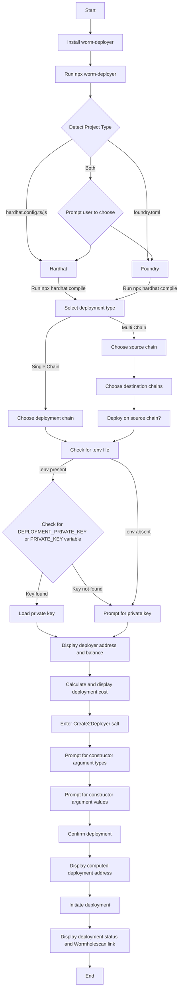

# User Flow

```mermaid
flowchart TD
    A[Start] --> B[Install worm-deployer]
    B --> C[Run npx worm-deployer]
    C --> D{Detect Project Type}
    D -->|hardhat.config.ts/js| E[Hardhat]
    D -->|foundry.toml| F[Foundry]
    D -->|Both| G{Prompt user to choose}
    G --> E
    G --> F
    E --> |Run npx hardhat compile| J[Select deployment type]
    F --> |Run npx hardhat compile| J[Select deployment type]
    J -->|Single Chain| K[Choose deployment chain]
    J -->|Multi Chain| L[Choose source chain]
    L --> M[Choose destination chains]
    M --> N[Deploy on source chain?]
    K --> O[Check for .env file]
    N --> O
    O -->|.env present| P{Check for DEPLOYMENT_PRIVATE_KEY or PRIVATE_KEY variable}
    P -->|Key found| Q[Load private key]
    P -->|Key not found| R[Prompt for private key]
    O -->|.env absent| R
    Q --> S[Display deployer address and balance]
    R --> S
    S --> T[Calculate and display deployment cost]
    T --> U[Enter Create2Deployer salt]
    U --> V[Prompt for constructor argument types]
    V --> W[Prompt for constructor argument values]
    W --> X[Confirm deployment]
    X --> Y[Display computed deployment address]
    Y --> Z[Initiate deployment]
    Z --> AA[Display deployment status and Wormholescan link]
    AA --> AB[End]
```